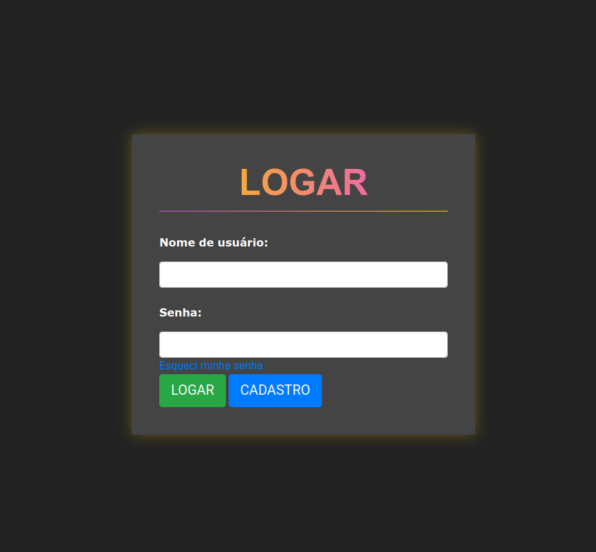
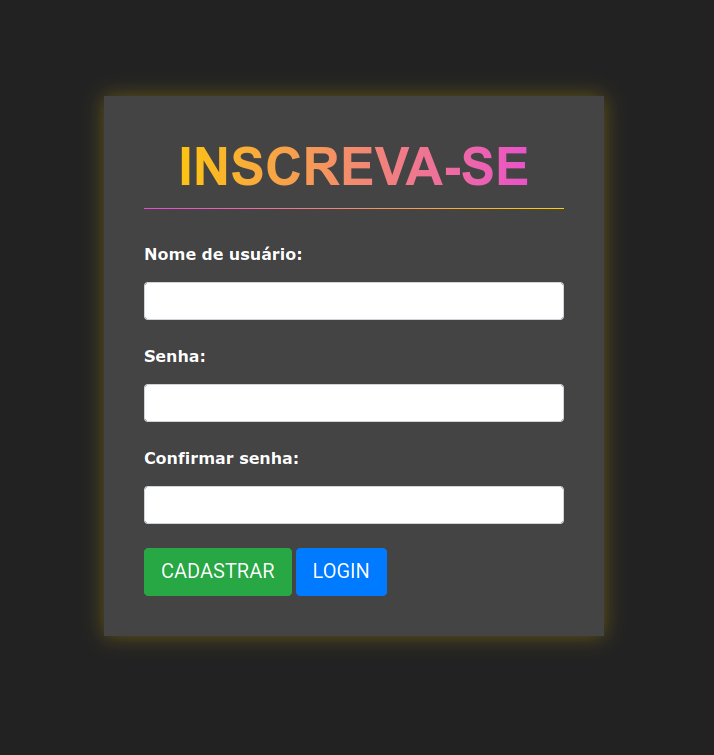
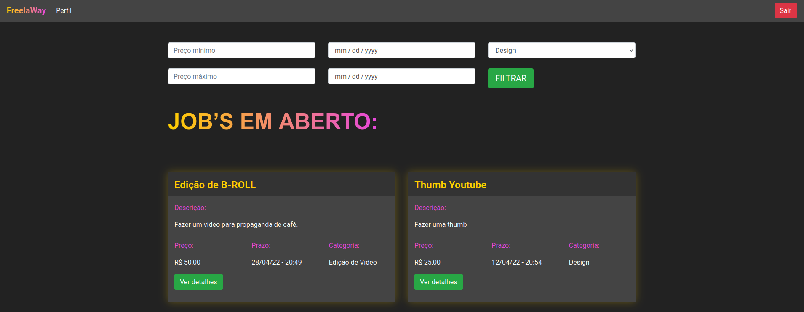
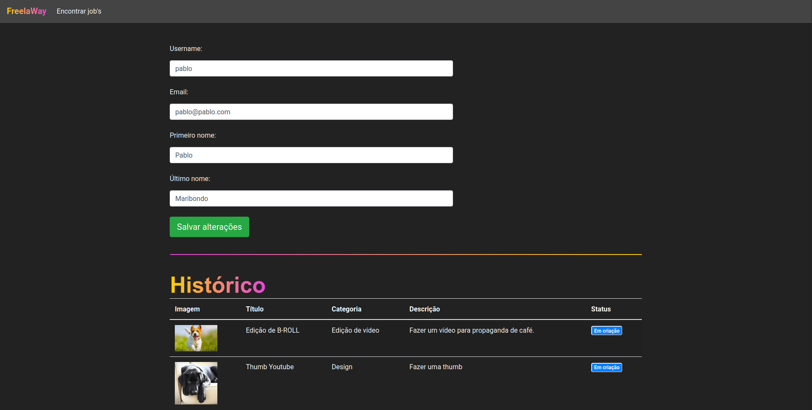

<h1 align="center">
  
</h1>

<h4 align="center">
  [PyStack Week 3.0] FreelaWay
</h4>

## 💻 Projeto

Projeto desenvolvido durante as aulas do evento **PyStack Week 3.0**, oferecido pela [Pythonando][pythonando].

A aplicação desenvolvida tem por finalidade gerenciar freelancers.

## 🛠 Tecnologias

As seguintes tecnologias foram utilizadas no desenvolvimento do projeto:

- [Django][django]

## 📷 Screenshots

<kbd>
  
</kbd>

<kbd>
  
</kbd>

<kbd>
  
</kbd>

<kbd>
  
</kbd>

[pythonando]: https://pythonando.com.br/
[django]: https://www.djangoproject.com/
